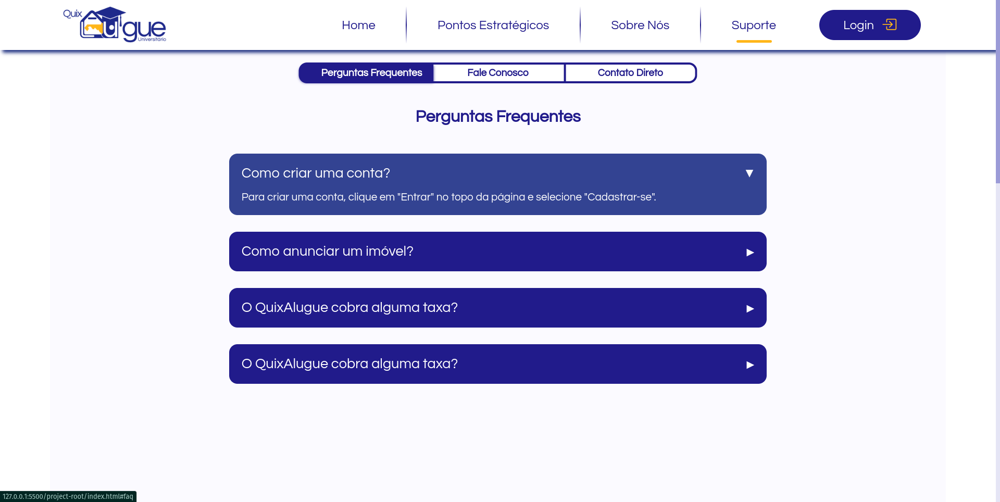
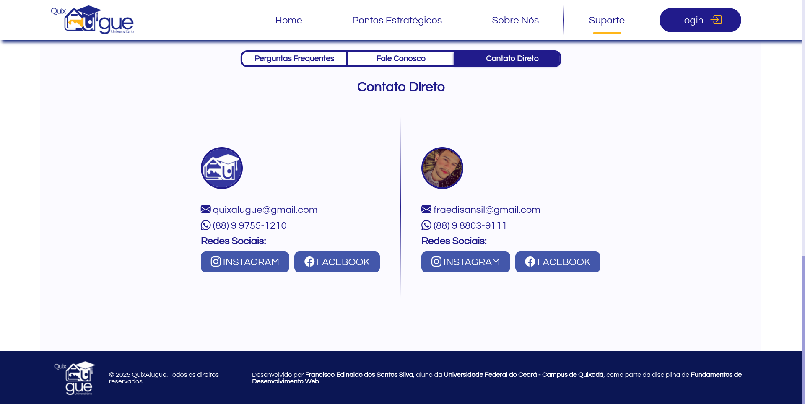

# Telas do QuixAlugue Universitário

As 4 telas implementadas foram: **Sobre Nós**, **Suporte**, **Login** e **Cadastro**. 

Os códigos HTML, CSS e JS das telas já estão atualizados e é possível fazer navegação entre elas.

Colocarei abaixo as imagens capturadas das telas para facilitar a visualização e uma breve descrição das seções.

## Tela de **Sobre nós**:

Nessa seção nós temos 3 subseções: Missão, Visão e Valores, que detalha de forma breve e clara a finalidade do projeto e seus impactos. 

### Sobre nós - Tela 1

### Sobre nós - Tela 2

## Tela de **Suporte**:

A seção de Suporte é dividida em 3 subseções: "Perguntas frequentes", "Fale conosco" e "Contato direto". Nessa seção foi implementado um menu que fica fixo na parte superior da seção. Nele, é possível navegar entres as subceções clicando nos seus respectivos links.

### Suporte - Faqs 

### Suporte - Fale Conosco

### Suporte - Contato Direto

## Tela de **Login**:

A seção de login foi implementada dentro de um modal sobre a página inicial, ao clicar no botão de "Login" no header, esse modal é aberto. 

### Login 

## Tela de **Login**:

Assim como na seção anterior, o Cadastro foi implementado dentro de um modal(mesmo modal de login).

### Cadastro 

